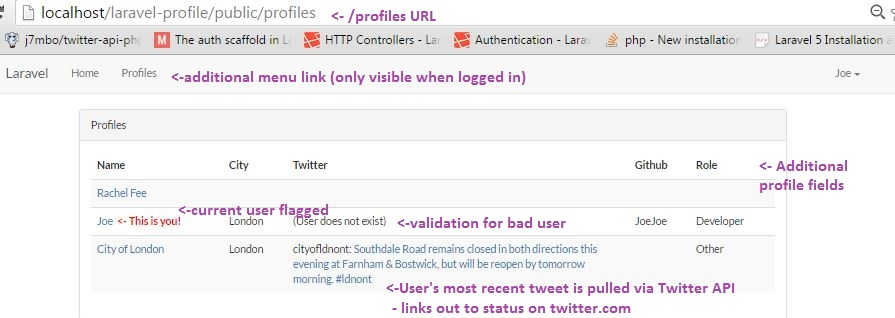

# laravel-profile

My very first laravel project. 

Built using Laravel 5.2, PHP 5.5.33, mySQL 

-Allows users to sign up with additional data.
-On login or successful signup, User is redirected to /profiles.
-/profiles displays list of User accounts, including additional data specified at Login.
-/profiles is accessible via menu bar at the top.
-Name is linked to user's email address.
-If valid Twitter name is provided, user's last Tweet is displayed alongside their name, linking out to Twitter.com. 
-If invalid twitter name is provided, error message is displayed instead of username.
-Twitter auth keys can be updated via config/twitter.php
-Current user is noted in the name column.

PHP unit tests are included to test redirects and account creation.

My redirects were acting a little finicky from time to time, I believe I've solved the issue, but I apologize if they fail! 